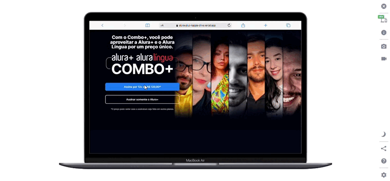

# Alura Plus

## About

This is the development of a project called Alura Plus, presenting some concepts for manipulating elements and positioning with flexbox and grid layout. I can highlight that the most edifying part of this planning was not repeating code, that is, reusing what was repeated.

Divided into two layers main and footer - containing the initial part within the main, and other presentation sections. The footer is made up of an image, list and text, while the other sections are made up of a title, text and image corresponding to the alura's "marketing".

## Layout

Here is the link to access the project - deploy:
[Alura Plus](https://alura-plus-kappa-olive.vercel.app/).



## How to execute the project?

```bash
# Terminal

git clone https://gitlab.com/mateusdev3400/alura-plus
git clone https://github.com/mateusdev3400/alura-plus

cd alura-plus/

index.html # Live Server / C://
```

## Technologies

The following tools were used in the construction of the project:

### Frontend

- HTML5
- CSS3

## Contributors

<table>
    <thead>
        <tr>
            <td>
                
            </td>
        </tr>
    </thead>
    <tbody>
        <tr>
            <th>Mateus Maciel</th>
        </tr>
    </tbody>
</table>

### How to contribute

- Fork the project.
- Create a new branch with your changes: ```bash git checkout -b my-feature```
- Save the changes and create a confirmation message telling you what you did: ```git commit -m "modified file"```
- Submit your changes: ```git push origin my-feature```

## Licença

This project is licensed under the Alura Cursos license.